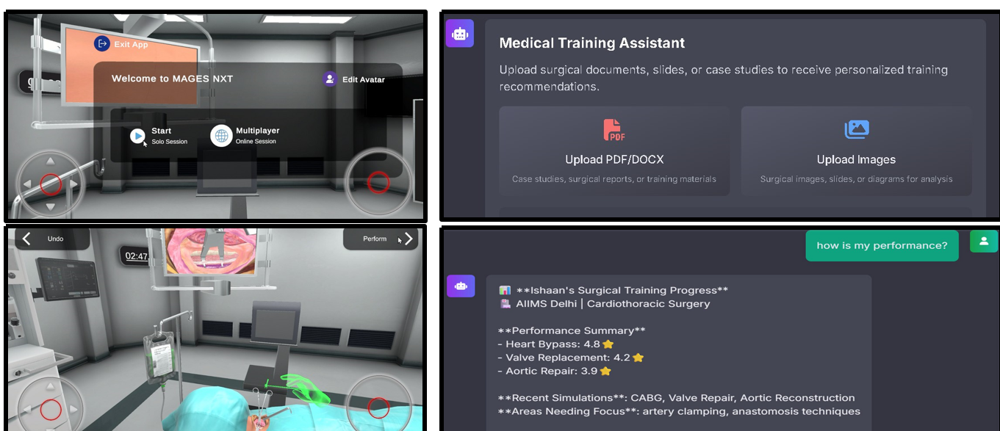
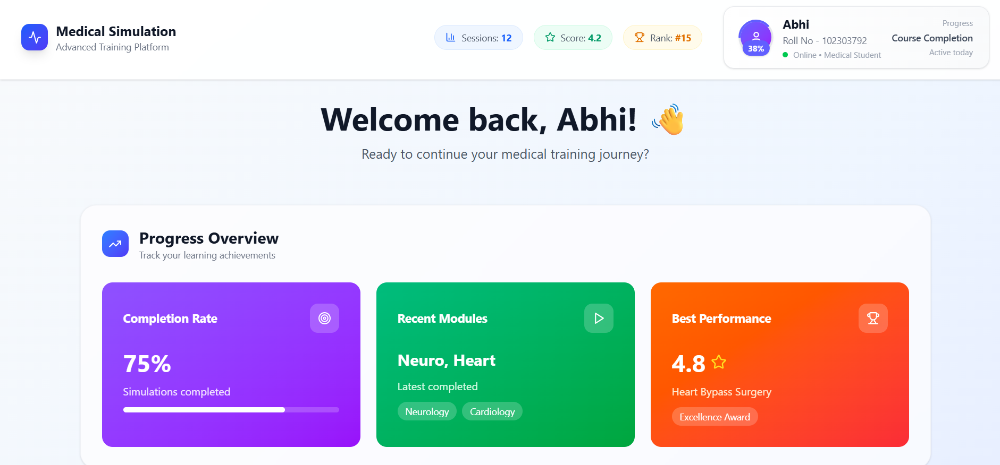

<div align="center">

# 🩺 Medimentor
### AI Surgical Mentor & VR Simulator

**An intelligent, full-stack platform that combines AI-driven surgical guidance with immersive VR training for the next generation of medical students.**

[](https://final-med.vercel.app)
[](https://medimentor-two.vercel.app)
[](https://medical-vr.vercel.app)

</div>

---

## 📖 Overview

**Medimentor** is a full-stack platform built for medical students that unifies three core pillars of modern surgical education:

- 🤖 **AI-powered surgical guidance** — context-aware answers to clinical and procedural questions
- 📊 **Personalized learning & performance tracking** — data-driven insight into student progress
- 🕶 **Unity-based VR surgical simulation** — hands-on, realistic practice in a risk-free environment

Students can register and log in, chat with a medical AI assistant, track their performance metrics over time, and practice surgical procedures in an interactive VR simulator — all from a single, responsive platform.

---

## 🖼 Screenshots

<div align="center">

**VR Surgical Simulator & AI Training Assistant**



*Left: Unity-based VR surgical simulator (MAGES NXT) for hands-on procedure practice.*
*Right: AI Medical Training Assistant analyzing uploaded case studies and surgical images to deliver personalized performance feedback.*

<br/>

**Student Performance Dashboard**



*A real-time dashboard tracking session count, average score, leaderboard rank, completion rate, recent modules, and best-performing simulations.*

</div>

---

## ✨ Features

| Feature | Description |
|---|---|
| 🔐 **Secure Login & Signup** | Personalized dashboard tailored to each student |
| 🤖 **AI Surgical Chatbot** | Context-aware answers to surgical & medical queries |
| 📊 **Performance Tracker** | Maps strengths and highlights areas needing improvement |
| 🕹 **Unity VR Surgery Simulator** | Realistic, interactive surgery practice with real-time feedback |
| 📈 **Progress Analytics** | Session history, scores, completion rate, and leaderboard ranking |
| 📱 **Responsive Design** | Works seamlessly across desktop, mobile, and VR headsets |

---

## 🛠 Tech Stack

<div align="center">

| Layer | Technology |
|---|---|
| **Frontend** | React 18 + Vite, Tailwind CSS |
| **Backend** | Python (FastAPI), CORS, secure environment variables |
| **AI Model** | OpenAI GPT API |
| **VR Simulation** | Unity + WebGL Build |
| **Deployment** | Vercel (Frontend & VR) · Render (Backend API) |

</div>

---

## 🚀 Getting Started

### Prerequisites
- Node.js (v18+) and npm
- Python 3.9+
- Git

### 1️⃣ Clone the Repository
```bash
git clone https://github.com/Ishaan0709/Medimentor.git
cd Medimentor
```

### 2️⃣ Backend Setup
```bash
cd backend
pip install -r ../requirements.txt
uvicorn main:app --reload
```

### 3️⃣ Frontend Setup
```bash
cd frontend
npm install
npm run dev
```

The app will be available locally once both the backend and frontend servers are running.

---

## 🌐 Live Deployments

| Component | Link |
|---|---|
| 🌐 Main Website | [final-med.vercel.app](https://final-med.vercel.app) |
| 🤖 AI Chatbot | [medimentor-two.vercel.app](https://medimentor-two.vercel.app) |
| 🕶 VR Surgery Simulator | [medical-vr.vercel.app](https://medical-vr.vercel.app) |

---

## 📌 Project Structure

```
Medimentor/
├── assets/            # README screenshots
├── backend/           # FastAPI backend & AI integration
├── frontend/          # React + Vite + Tailwind frontend
├── requirements.txt   # Python dependencies
└── README.md
```

---

<div align="center">

Built with ❤️ to make surgical training smarter, safer, and more accessible.

</div>
